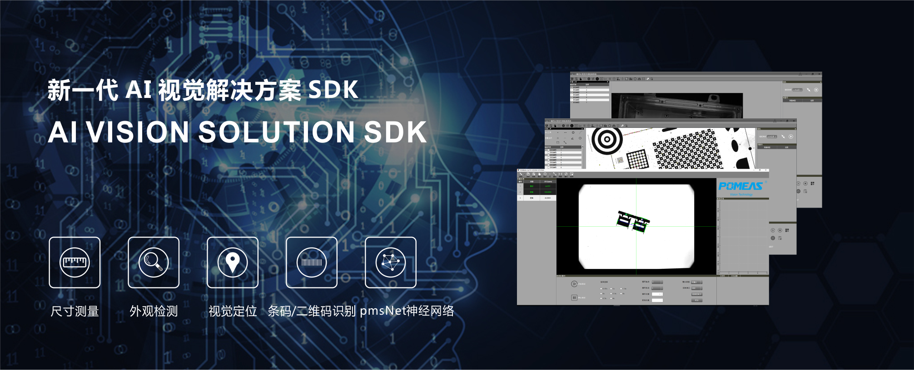
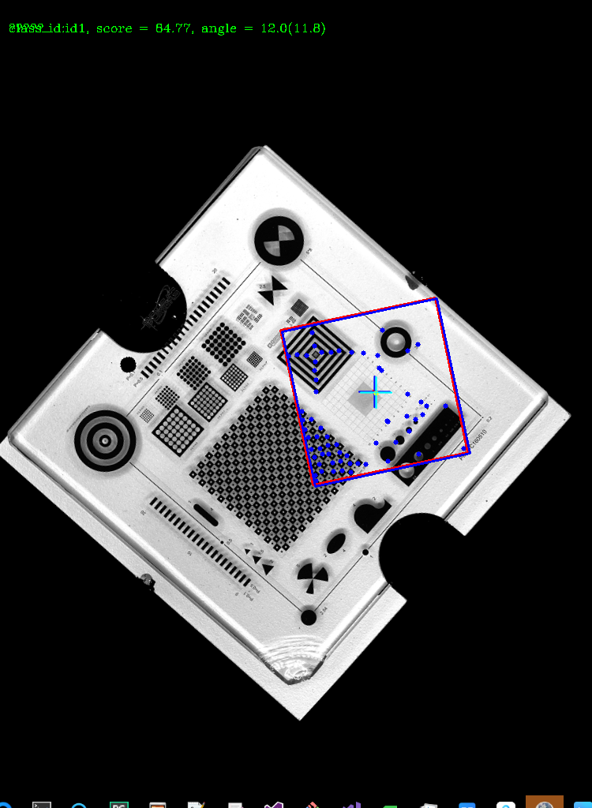
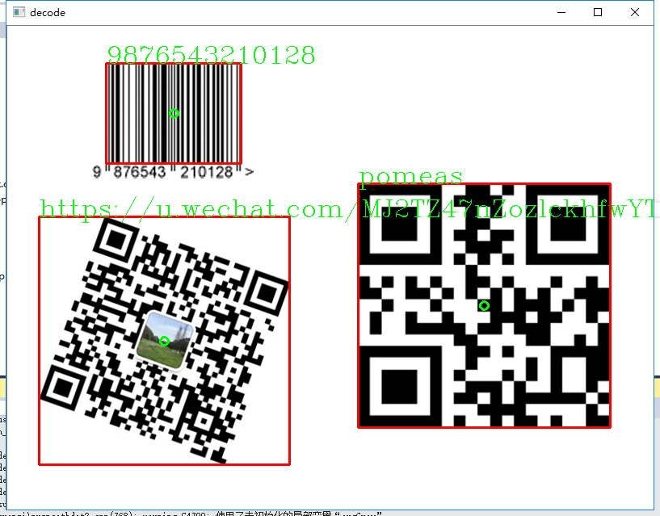
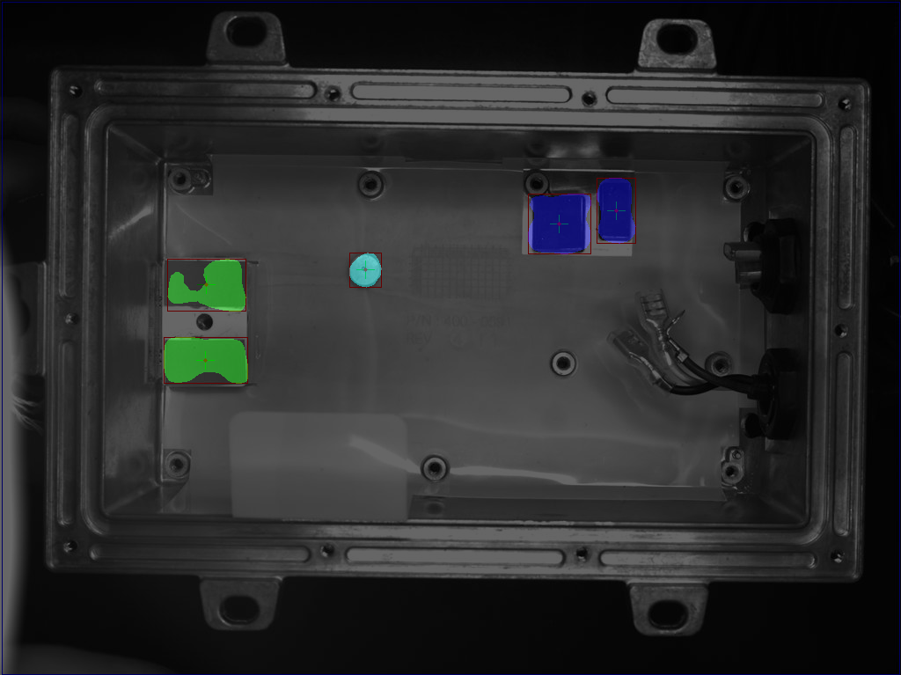
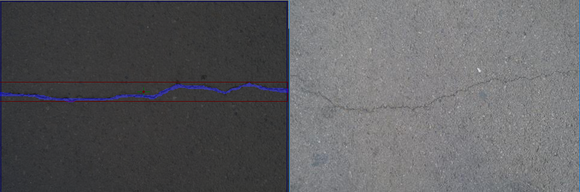
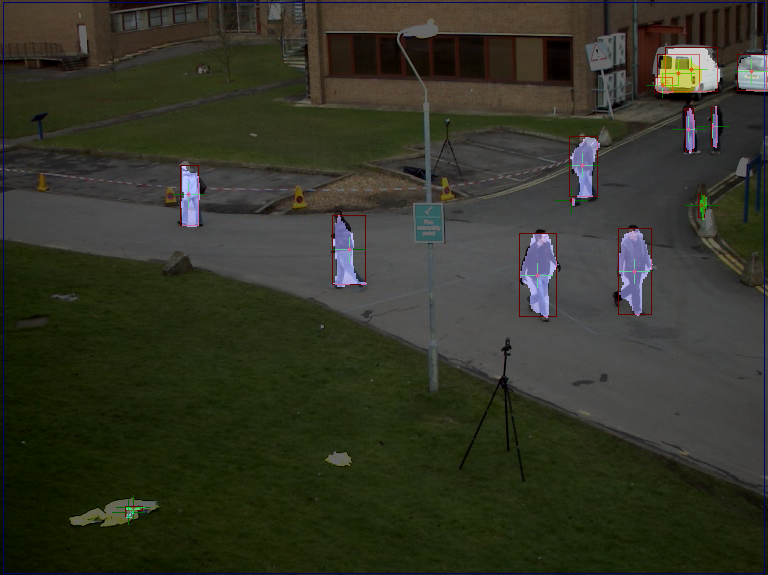
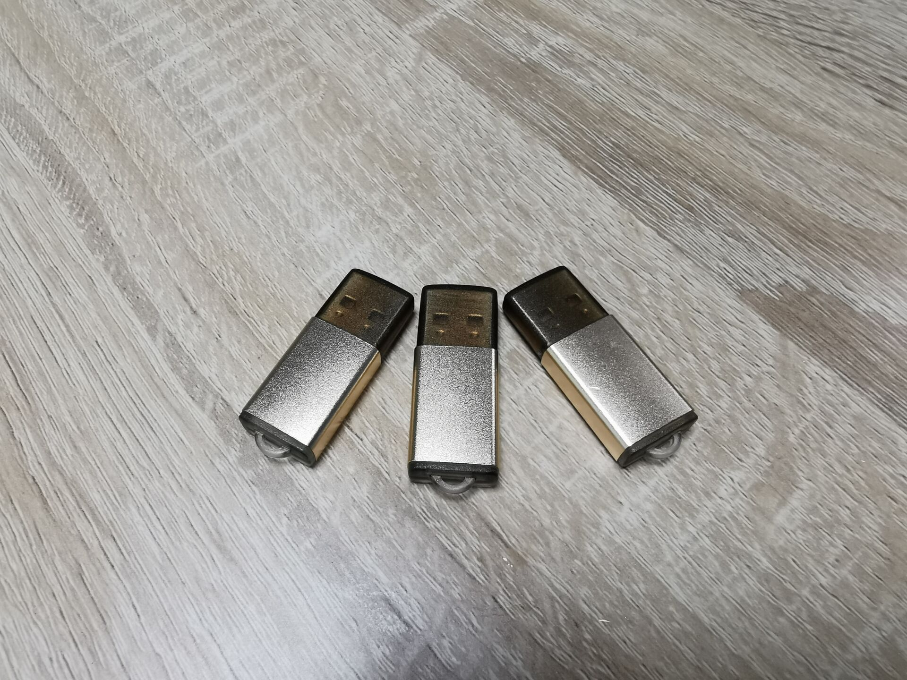

   X-Vision为自主研发的新一代AI视觉解决方案SDK,采用先进的机器视觉和AI神经网络等核心技术,能够有效解决传统机器视觉系统过于复杂、精度低、检测不可靠等问题，使得视觉自动化设备更加简单、稳定、智能、加速研发项目落地。

X-Vision具有以下功能:

尺寸视觉高精度测量

外观检测（瑕疵）

视觉定位/机器人手眼标定

条码/二维码识别

自动调焦/调光

pmsNet和pmsFCN神经网络外观检测

视觉对象序列化流服务

丰富的图象处理接口（上百个图像处理算子函数）

==============================================

专业 && 高效 && 稳定&& 可靠的AI视觉解决方案支持
(算法、软件、项目、产品设备开发）： 
请联系QQ_514704465

&欢迎加入开发团队QQ群：142669208&

==============================================

应用案例:
cd bin/

模板匹配定位:

./testSerialization_x64.exe

条码/二维码识别：

./testCodeRecog.exe

X-VISION pmsNet网络分割应用一:

./testDL_SegNet_dj_x64.exe

(下载模型: models/segNet_3 放置于imvcfg/下)

X-VISION pmsNet网络分割应用二:

./testDL_SegNet_road_x64.exe

(下载模型: models/segNet_0 放置于imvcfg/下)

X-VISION pmsNet行人检测应用三:

(下载模型: models/segNet_5 放置于imvcfg/下)

==============================================

使用硬件加密狗开发，加速项目应用、功能更强！

